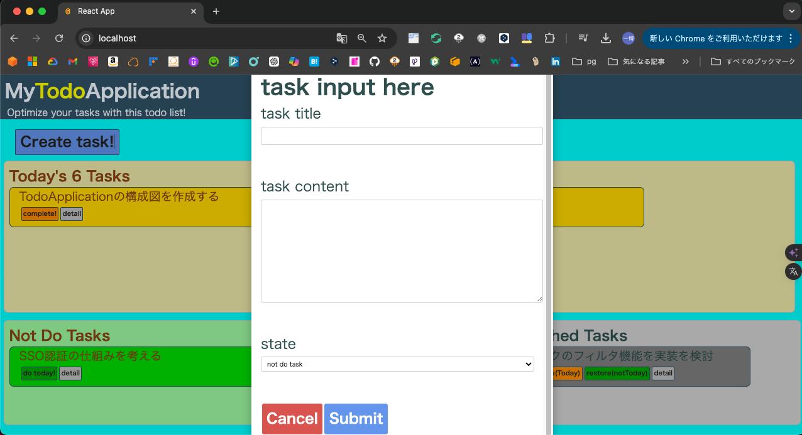
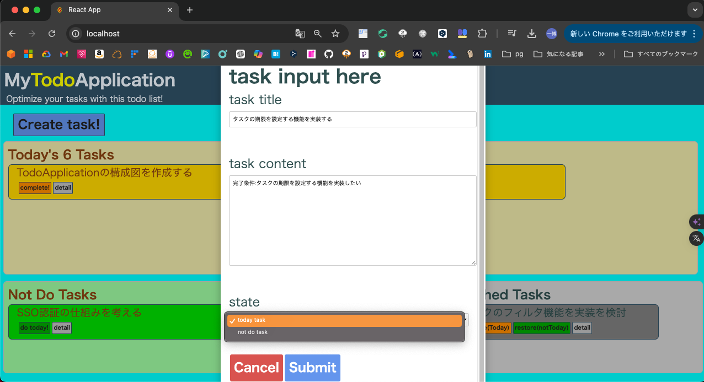
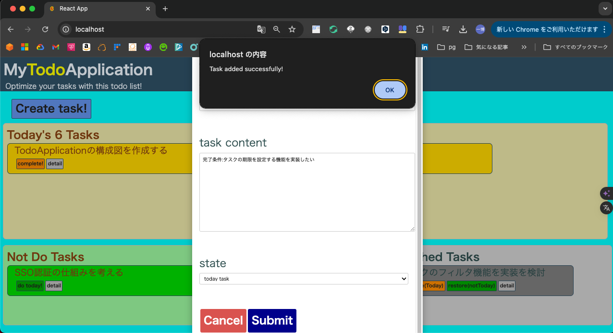
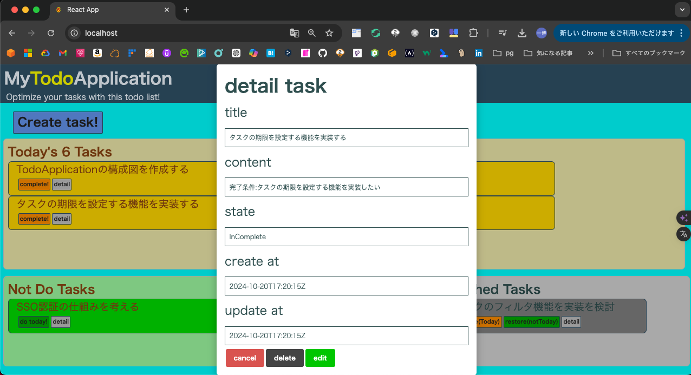
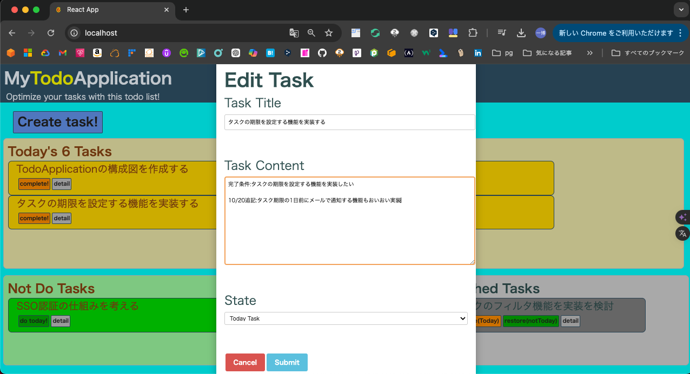
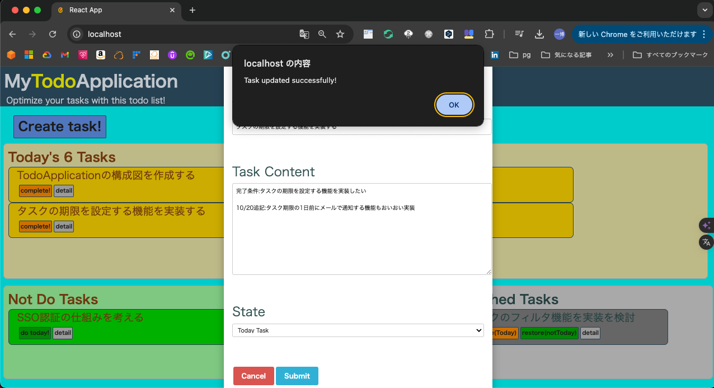
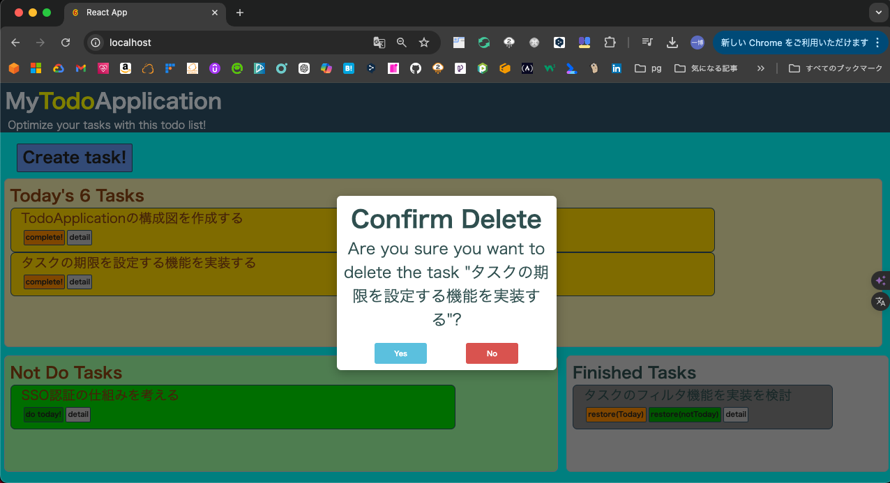
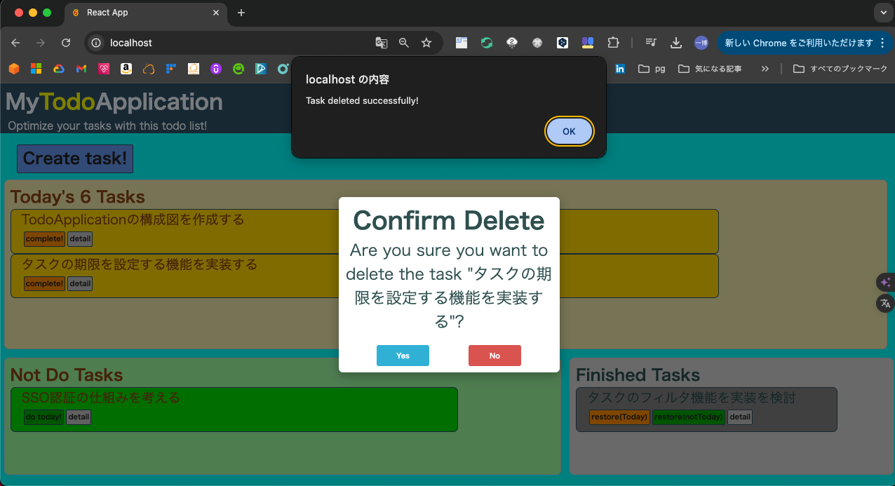
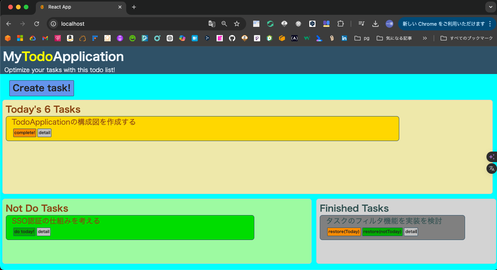
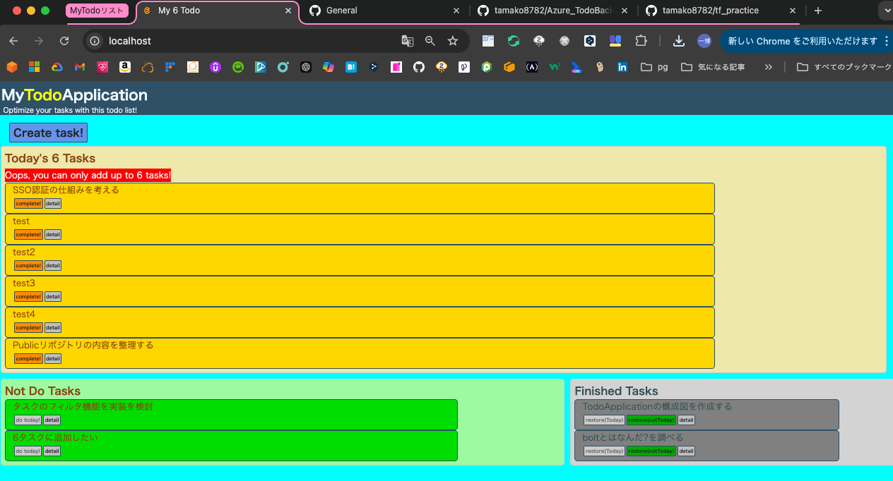

## 1. 概要

### 1.1 目的
- 学習目的
  - Kubernetesを用いたコンテナオーケストレーションの理解を深め更にTerraformCloudを用いたインフラストラクチャの管理を自動化するワークフローを作成する。
  - アプリケーションに置いてはGolangでの標準パッケージのみを用いたCRUDの基本理解とAPIサーバーの構築の実施、Reactを用いたSPAでのWebUIの構築の実施を実施する。

- 業務目的
  - タスク管理の手法を提供し業務パフォーマンスの向上に寄与するためのSPA(Single Page Application)型TodoWebアプリケーションを構築することを目的とする。

### 1.2 背景
- よくある各コンポーネントを技術習得するための手段としては書籍やUdemy、qiita等サイトに掲載された情報からハンズオンでベーシックアプリケーションの構築、ビルドデプロイ手法の検討、環境構築を実施するものがある。

  当初はそれらを何度も反復し技術習得に勤しんだが、その習得した技術がサービスとして構成されたときにどのように役立ちどう重要だったのかがわからず"実際に試してみたけど現場で活きない!すぐ忘れる!"ことがよくあった。
  また多くの企業でサービスとして形成しているものと自身が手掛けたものの品質的乖離の大きさに対して辟易としてしまうことが多々あった。

  そのため、コンポーネントを複合し、自身が使いたいと思えるようなアプリ制作をする過程で、自身のより深いWebアプリへの理解とエンジニアとしての技術力向上につながるのではと思いこの度のプロジェクトを起案した。
  もちろん、このプロジェクトにて作成したアプリは実際に作者が使用していく予定である。

### 1.3 Todoアプリケーションの特徴
#### 主要機能
1. 実施すべき項目欄(やるべきタスク)を設ける
1. やるべきタスクには6つのタスクを追加する枠がある。
1. やるべきタスクには6つ以上は登録できない。
1. やるべきタスクは最上段だけがライトアップされそれ以外はグレーアウトされる
1. 今やるべきではないタスクを書く場所がある。
1. 今やるべきではないタスクの登録件数に制限はない。(ただしページ送りで10ページずつ区切られる)
1. 完了済みタスクを書く場所がある
1. やるべきタスクを実施して完了ボタンを実施したら完了済みタスクに表示されるようになる
1. 指定した時間でやるべきタスクの内容は今やるべきでないタスクに戻される

#### 副次機能(ゆくゆく実装)
1. ユーザー認証(ローカルで動かす想定なら後回しでもいい)
1. 今やるべきでないタスクは優先度やジャンル別で更に細分化したい
1. タスク完了時にファンファーレてきな派手な演出がしたい
1. 完了済みタスクの着手時間の統計値をグラフ化していきたい
1. タスクのタグ(自由記入、主にタスクカテゴリ等記載を想定)機能の導入
1. タスクに対してのコメント機能の追加
1. タスクのフィルタ、ソート機能を導入
1. タスクをcsvでエクスポートする方法を導入
1. 生成AIからタスク遂行のためのロードマップを提案してくれる機能をつけてみたい

### 1.4 アプリケーション動作サンプル

- メイン画面

- タスク作成画面

- タスク詳細画面

- タスク編集画面

- タスク削除確認画面

- アラート画面

- 動作検証動画
[動作検証動画](./diagram/movie/demoplay.mov)

## 2. アーキテクチャ概要

### 2.1 全体構成図
  - 全体アーキテクチャ構成図
※現時点では構想のみ
　MSの公式サイトから抜粋したものを仮掲載

    
  - クラスター構成図

### 2.2 主要コンポーネント一覧
- **Webサーバ**: Nginx 1.27.2
- **プログラミング言語**: Go 1.23
- **フロントエンド**: React 18.3.1
- **データベース**: MySQL 8.2.0
- **マイグレーションツール**: migrate/migrate 4.11.0
- **コンテナ**: Docker 24.0.7
- **コンテナオーケストレーション(開発環境)**: Docker Compose 2.23.3
- **コンテナオーケストレーション(クラスター)**: Kubernetes cluster 1.30.0
- **コンテナオーケストレーション(クライアント)**: Kubernetes Kubectl 1.30.2
- **コンテナオーケストレーション(kubernetesマニフェスト管理)**: kustomize 5.4.3
- **クラウドプロバイダー**: Azure (将来的に検討)

## 3. 詳細設計

### 3.1 アプリケーション層

#### 3.1.1 Webアプリケーション
- **概要**: Goを使用して開発されたタスク管理アプリケーションと、Reactを使用したフロントエンド。
- **主要機能**:
  - **タスク管理**: タスクの登録、編集、削除、完了、未完了の状態管理
  - **タスク表示**: 当日実施予定タスクと実施しないタスクを一覧表示
  - **ユーザー認証**: JWTを使用した認証機能 (予定)
  - **通知機能**: タスクの締切前に通知を送信 (予定)
- **バックエンド**:
  - **フレームワーク**: Goの標準ライブラリを使用
  - **データベース接続**: MySQLを使、Goの標準SQLドライバを利用
  - **APIエンドポイント**:
    - `GET /task`: タスクの一覧を取得
    - `POST /task/create`: 新しいタスクを作成
    - `GET /task/{id}`: 特定のタスクの詳細を取得
    - `PATCH /task/{id}/update`: タスクを更新
    - `DELETE /task/{id}/delete`: タスクを削除
    - `PATCH /task/{id}/change`: タスクの状態を変更
  - **エラーハンドリング**: カスタムミドルウェアを使用してエラーレスポンスを統一
- **フロントエンド**:
  - **フレームワーク**: Reactを使用
  - **状態管理**: 現在は`useState`を使用してアプリケーションの状態を管理、将来的にReduxに置き換える予定
  - **UIライブラリ**: Material-UIを使用してスタイリング(予定)
  - **ルーティング**: React Routerを使用してページ遷移を管理(予定)
  - **API通信**: Fetch APIを使用してバックエンドと通信

#### 3.1.2 APIゲートウェイ
- **概要**: Nginxを使用して、APIリクエストを各マイクロサービスにルーティング。
- **設定**:
  - **リバースプロキシ**: 各サービスへのリクエストを適切にルーティング
    - `/api/`へのリクエストはバックエンドサービスにプロキシされる
    - 必要なヘッダー情報をバックエンドに転送
  - **静的ファイルの提供**: Reactの静的ファイルを`/usr/share/nginx/html`から提供し、`try_files`ディレクティブを使用してSPAのルーティングをサポート
  - **ロードバランシング**: 複数のバックエンドインスタンス間で負荷を分散（将来的に設定予定）
  - **SSL/TLS**: セキュアな通信を確保するためのSSL設定（将来的に設定予定）
  - **キャッシュ**: 静的コンテンツのキャッシュ設定（将来的に設定予定）

### 3.2 データ層

#### 3.2.1 データベース
- **使用DB**: MySQL 8.2.0
- **データベース構造**: タスク管理用のテーブルを設計。
  - **テーブル名**: task
    - **カラム一覧**:
      - `task_id`: INT, プライマリキー, 自動インクリメント
      - `title`: VARCHAR(255), タスクのタイトル, 必須項目
      - `contents`: TEXT, タスクの詳細内容
      - `task_state`: ENUM('InComplete', 'Finished', 'NotDoTask'), タスクの状態, デフォルトは'NotDoTask'
      - `updated_at`: DATETIME, 更新日時, デフォルトはCURRENT_TIMESTAMP, 更新時に自動更新
      - `created_at`: DATETIME, 作成日時, デフォルトはCURRENT_TIMESTAMP
  - **インデックス**:
    - `PRIMARY KEY (task_id)`

### 3.3 インフラ層

#### 3.3.1 クラウドインフラ
- **クラウドプロバイダー**: Azure（予定）
- **主要サービス**: 
  - Azure Kubernetes Service (AKS) (予定)
  - Azure Database for MySQL（予定）
  - Azure DNS
  - Azure Application Gateway
  - Azure Front Door
  - Azure Virtual Network (VNet)
  - Azure Key Vault
  - Azure Blob Storage

#### 3.3.2 ネットワーク設計
- **VNet設計**: 未定。

### 3.4 CI/CDパイプライン

#### 3.4.1 GitHub Actions
- **概要**: コードのビルド、テスト、デプロイを自動化するGitHub Actionsのワークフローが設定済み。
- **ワークフロー(現在)**: `go-test.yml`, `kubernetes-test.yml`, `react-test.yml`。
- **今後の追加予定**:
  - **Terraform Apply**: インフラストラクチャの管理を自動化するためのTerraformCloudを用いたワークフローを追加予定。
    - **ワークフロー名**: `Terraform Apply`
    - **トリガー**: `master`ブランチへのプッシュ
    - **ジョブ**: 
      - **名前**: "Terraform Apply"
      - **実行環境**: `ubuntu-latest`
      - **ステップ**:
        - コードのチェックアウト
        - Terraform設定のアップロード
        - Apply Runの作成
        - Applyの実行
  - **Terraform Plan**: プルリクエスト時にTerraformのプランを実行し、結果をPRにコメントするワークフローを追加予定。
    - **ワークフロー名**: `Terraform Plan`
    - **トリガー**: プルリクエスト
    - **ジョブ**:
      - **名前**: "Terraform Plan"
      - **実行環境**: `ubuntu-latest`
      - **ステップ**:
        - コードのチェックアウト
        - Terraform設定のアップロード（スペキュレーティブモード）
        - Plan Runの作成
        - Planの出力を取得
        - PRにPlanの結果をコメント

### 3.5 ロギングとモニタリング
- **設定**: Azure Log AnalyticsやAzure Monitorを使用する予定（将来的に追加）。

## 4. セキュリティ設計

### 4.1 認証・認可
- **概要**: OAuth 2.0を使用したユーザ認証の実装（将来的に検討）。

### 4.2 データ保護
- **データ暗号化**: 暗号化に関する設定は未定。

## 5. デプロイメントガイド

### 5.1 開発環境セットアップ
- **必要ツール**: Docker、Docker Compose、kubectlを使用。
- **開発環境**:
  - **MyPC**: 
    - OS: 14.6.1（23G93）
    - アーキテクチャ: ARM64
    - カーネルバージョン: Darwin Kernel Version 23.6.0
  - **Docker Desktop**: 
    - バージョン: 4.26.1
  - **Kind**: 
    - バージョン: kind 0.23.0

### 5.2 本番環境デプロイ
- **CI/CDパイプライン**: GitHub Actionsによる自動化デプロイを設定予定。

## 6. テスト計画

### 6.1 ユニットテスト
- **概要**: GoおよびReactのコンポーネント対するユニットテスト、 Kubernetesの構文チェックが含まれています。

### 6.2 インテグレーションテスト
- **概要**: APIを含む各サービス間のテストを予定。

